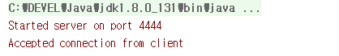
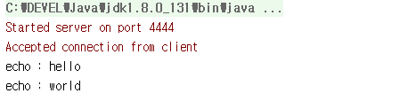
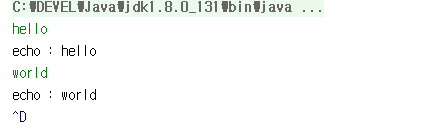

## 간단한 Echo Server, Echo Client 만들기

- java.io, java.net, Exception 처리 등을 할 수 있어야 개발 가능합니다.
- 해당 Echo Server는 동시에 여러개의 클라이언트가 접속할 수 없습니다.





키보드로 hello [enter] world [enter] ^d 
를 차례로 누릅니다. ^d 는 EoF(End of File)을 의미합니다.




```
package kr.or.connect.echo0;

import java.io.BufferedReader;
import java.io.InputStreamReader;
import java.io.OutputStreamWriter;
import java.io.PrintWriter;
import java.net.Socket;
import java.net.ServerSocket;

public class EchoServer {

    public static void main(String[] args) throws Exception {

        int port = 4444;
        ServerSocket serverSocket = new ServerSocket(port);
        System.err.println("Started server on port " + port);

        Socket clientSocket = serverSocket.accept();
        System.err.println("Accepted connection from client");

        BufferedReader br = new BufferedReader(new InputStreamReader(clientSocket.getInputStream()));
        PrintWriter pw = new PrintWriter(new OutputStreamWriter(clientSocket.getOutputStream()));

        String line = null;

        while((line = br.readLine()) != null){ // 클라이언트로부터 한줄을 읽어들인다.
            System.out.println("echo : " + line);
            pw.println("echo : " + line); // 클라이언트에게 한줄을 출력한다.
            pw.flush();
        }
        clientSocket.close();
        serverSocket.close();
    }
}

```

Server는 클라이언트의 접속을 대기해야 합니다.

- ServerSocket객체를 생성 후 accept()메소드를 호출하게 되면 클라이언트의 접속을 4444번 포트에서 기다리게 됩니다.
- accept()메소드는 클라이언트가 접속할 때까지 멈춰있는다고 해서 블럭킹 메소드라고 말합니다.
- 클라이언트가 접속할 경우 해당 클라이언트와 통신을 할 수 있는 Socket객체가 반환됩니다.
- 클라이언트와 통신하기 위해서 Socket으로부터 InputStream과 OutputStream을 얻었습니다.
- 한줄쓰고, 한줄 읽어들이기 위해서 BufferedReader, PrintWriter를 사용하였습니다.
- 클라이언트에게 정보를 출력할때는 출력후에 flush()메소드르 호출해야합니다.
- socket을 다 사용하고 나면 close()를 호출해야합니다. Exception처리를 잘 할 필요가 있습니다.


```
package kr.or.connect.echo0;

import java.io.BufferedReader;
import java.io.InputStreamReader;
import java.io.OutputStreamWriter;
import java.io.PrintWriter;
import java.net.Socket;

public class EchoClient {
    public static void main(String args[]) throws Exception{
        Socket server = new Socket("127.0.0.1", 4444);
        BufferedReader keyboard = new BufferedReader(new InputStreamReader(System.in));
        BufferedReader br = new BufferedReader(new InputStreamReader(server.getInputStream()));
        PrintWriter pw = new PrintWriter(new OutputStreamWriter(server.getOutputStream()));

        String line = null;
        String readLine = null;
        while((line = keyboard.readLine()) != null){ // 키보드로부터 한줄 읽어들임
            pw.println(line); // server에게 한줄 보냄
            pw.flush();
            readLine = br.readLine(); // server가 보내는 한줄을 읽어들임
            System.out.println(readLine); // server가 보내는 한줄을 출력함
        }
        server.close();
    }
}

```

- 키보드로부터 한줄씩 입력받기 위한 객체를 생성하여 keyboard변수에 할당하였습니다.
- server에 접속하기 위해 Socket객체를 생성합니다. server의 ip와 포트를 생성자에 넣었습니다.
- 해당 socket이 오류가 나지 않고 잘 생성되었다면 server와 접속이 잘 되었다는 것을 의미합니다. server의 경우 이 때 accept()메소드가 클라이언트와 통신할 수 있는 Socket객체를 반환합니다.
- 서버에 정보를 전달하고 읽어오기 위한 객체를 생성하여 변수 br, pw에 할당하였습니다.
- keyboard로부터 읽어들인 정보를 서버에 보내고, 바로 서버가 보내준 값을 읽어들여 화면에 출력합니다.

