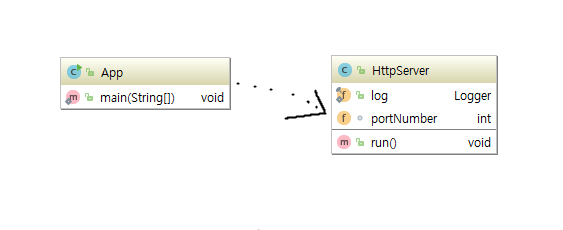
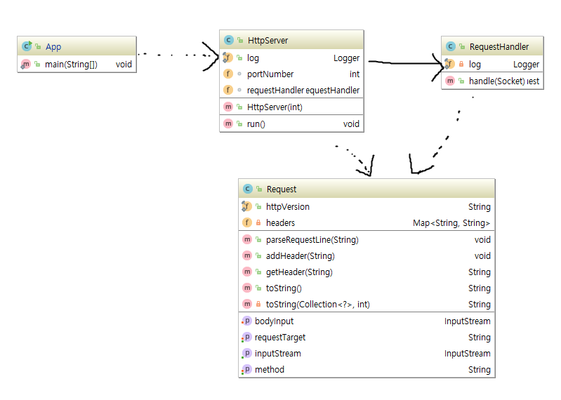
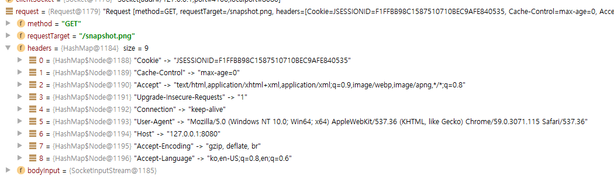
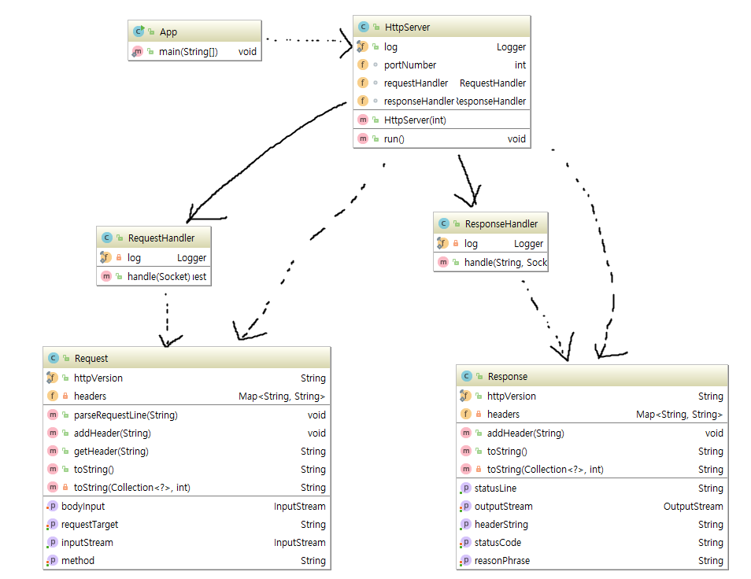
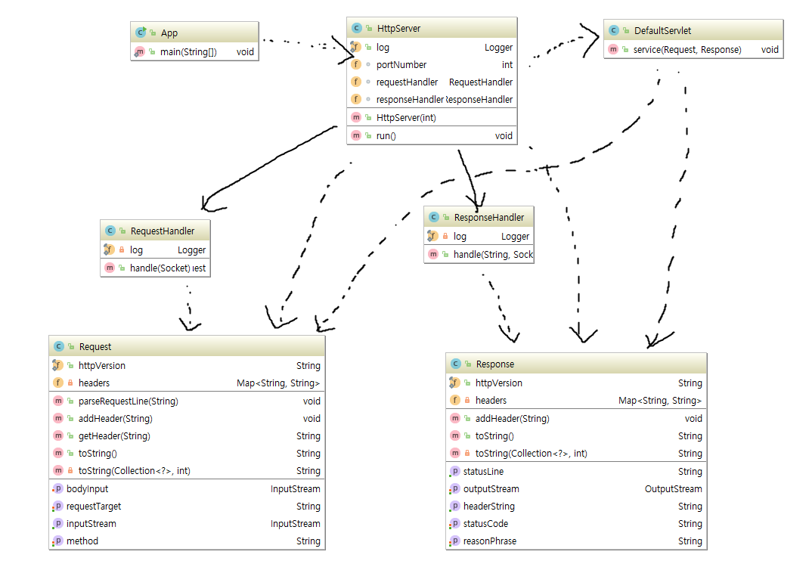
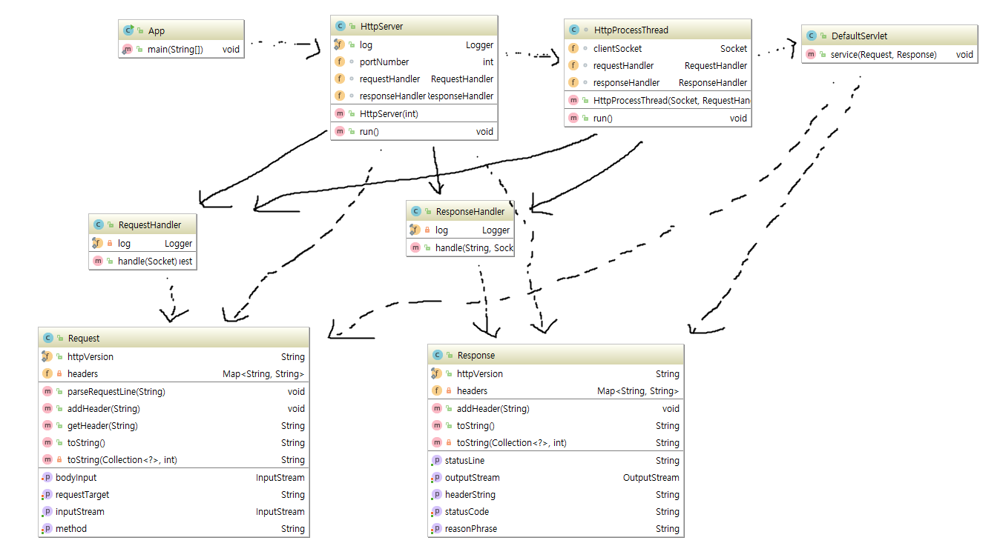

# 웹서버 만들기 실습

개인 프로젝트
============

목표
----
- 간단한 웹서버를 만들어 봄으로 웹의 동작 원리를 이해한다.

기본RULE
--------
- 혼자 진행
- 인터넷 사용가능
- 멘토 도움을 받지 않음
- 조원을 비롯한 다른 멤버들의 코드를 참고하지 않음
- 필요시 사전에 학습한 내용을 참고하는 건 무방하나 프로젝트를 통째로 복사하거나 파일 복사로 가져오는 건 금지
    - 필요하다면 눈으로 보고 직접 타이핑
- 적절한 중간 커밋과 커밋 메시지를 작성
    - 과제 다 완료 후 코드 커밋 한 개로 프로젝트를 끝내지 않도록 할 것
        - 미리 계획을 세우는 걸 추천

기타
----
- 개인 프로젝트의 결과는 채점하거나 평가하지 않습니다.


과제
===

개요
----
- 간단한 HTTP Server를 만들어봅니다.

기본사항
-------
- maven 프로젝트로 만들어서 컴파일 및 빌드를 진행합니다.
- Java 7 이상을 사용합니다.
- 기본 서버 포트는 8080을 사용합니다.
- HTTP server 가 전체 구현되어 있는 JDK 내외의 HTTP Server 라이브러리는 사용하지 않습니다.
- 응답 헤더를 구현하기 시작한 이후부터는 상태 코드를 올바르게 구현 처리합니다.
- 각 Step의 Hint는 최소한의 힌트입니다. 추가로 필요한 부분은 직접 구현 및 찾아내야 합니다.
    - 굳이 힌트를 따르지 않아도 무방합니다. 더 나은 방법이 있다면 해당 방식으로 구현하세요!
- 테스트 코드를 같이 만들 수 있으면 + 가점 입니다.
- 클래스 필드에 대한 getter/setter 는 따로 언급하지 않습니다. 필요시 적절히 만드세요.
- 또한 지정된 메소드 이외의 메소드를 필요한 만큼 알아서 만드는 걸 권장합니다.
- 애매하다고 느껴지거나 고민되는 부분은 본인이 알아서 판단하거나 정합니다.

### STEP_00

- 비어있는 maven 프로젝트를 생성합니다.

### STEP_01

- main메소드를 가지고 있는 App클래스 작성합니다.
  - main메소드에서는 HttpServer객체를 생성하고, 해당 객체가 가지고 있는 run()메소드를 호출한다.
- run()메소드를 가지고 있는 HttpServer 클래스 작성합니다.
  - run()메소드에서는 ServerSocket이 Client접속을 기다리도록 합니다.


- Logging
  - 모든 서버 요청(Request)에 대해서는 로그를 남깁니다.
  - exception 시에도 에러 메시지를 로그로 남깁니다.
  - 필수 로그 내용은 시간과 요청페이지, client 정보(본인이 결정) 입니다.
  - logback.xml 설정 파일의 내용도 적절히 지정합니다.
  - Hint
      - maven dependency 처리하기



- 점선은 의존관계를 표현한다. 메소드에서 해당 객체를 사용한다는 것을 의미합니다.
- 실선은 연관관계를 표현한다. 클래스가 해당 클래스를 가진다는 것을 의미합니다.

- 확인
    - 브라우저를 통해 http://localhost:8080 으로 접근했을 콘솔에 올바른 로그를 남기는지 확인합니다.

###  STEP_02

- RequestHandler클래스는 Client Socket을 파라미터로 받아 Request객체를 반환하는 handle메소드를 가지고 있다.
- Request객체는 필드로 httpVersion, headers, method, requestTarget, bodyInput 등을 가지고 있다.



- handle메소드는 socket의 inputStream을 이용하여 정보를 읽어들여 httpVersion, headers, method, requestTarget의 값을 초기화 한다.
- 아래는 http://127.0.0.1:8080/snapshot.png 를 브라우저로 요청했을 때 request가 가지는 값에 대한 예제이다.
- http프로토콜의 헤더와 빈줄을 읽어들이고 나서, 해당 InputStream은 Request에 담아서 리턴한다. (Body에서 아직 읽어들일것이 남아있는 InputStream)
- 정보를 담은 Request 객체의 내용을 로그로 남겨주세요.



- 확인
  - 브라우저를 통해 접근했을 요청 주소에 맞게 콘솔에 올바른 로그를 남기는지 확인합니다.
  - http://localhost:8080 으로 접근했을때 로그 예.
    - Request [method=GET, requestTarget=/index.html, headers=[Cache-Control=max-age=0, Accept=text/html,application/xhtml+xml,application/xml;q=0.9,image/webp,image/apng,*/*;q=0.8, Upgrade-Insecure-Requests=1, Connection=keep-alive, User-Agent=Mozilla/5.0 (Windows NT 10.0; Win64; x64) AppleWebKit/537.36 (KHTML, like Gecko) Chrome/59.0.3071.115 Safari/537.36, Host=localhost:8080, Accept-Encoding=gzip, deflate, br, Accept-Language=ko-KR,ko;q=0.8,en-US;q=0.6,en;q=0.4]]

- 힌트
  - Requeset Class Fields
    - String method: GET/POST 등의 메소드, request line을 파싱해서 추출가능
    - String requestTarget: https://tools.ietf.org/html/rfc7230#section-3.1.1
    - String httpVersion: "HTTP/1.1"로 상수 고정
    - Map headers: String key/value 쌍으로 만들어지는 헤더정보. 구분자(delimiter)인 ":"를 포함시킬지 여부는 본인이 결정
  - Requeset Class Method
    - request 라인을 적절히 parsing 해서 method 필드와 requestTarget 필드에 값을 넣어주는 메소드
    - header line을 입력받으면 key/value 로 headers에 넣는 메소드
    - header key 값을 이용해서 header value를 돌려주는 메소드

  - RequestHandler Class
    - Request 처리를 담당하는 클래스를 만듭니다.
    - handle 메소드에서는 Request 객체를 내부에서 생성해서 요청처리를 수행하게 만듭니다.
    ```
    public class RequestHandler {
        public Request handle(Socket clientSocket){
        ...
    ```
---
    - HEADER 마지막을 구분해 내는 건 `while (!"".equals(line)) {}` 로 처리 가능합니다.
    - 문자열 처리: https://docs.oracle.com/javase/tutorial/java/data/manipstrings.html
### STEP_03

- ResponseHandler클래스는 requestTarget문자열과 Client Socket을 파라미터로 받아 Response객체를 반환하는 handle메소드를 가지고 있다.
- Response객체는 필드로 httpVersion, headers, statusLine, outputStream을 가지고 있다.
- http프로토콜의 응답 헤더와 빈줄을 출력하고 나서, 해당 OutputStream을 Response에 담아서 리턴한다. (Body에 출력을 해야할 OutputStream)
- Response 객체의 내용을 로그로 남겨주세요.  




- 확인
  - 브라우저를 통해 접근했을 요청 주소에 맞게 콘솔에 올바른 로그를 남기는지 확인합니다.
  - http://localhost:8080 으로 접근했을때 로그 예.
    - Response [statusCode=200, reasonPhrase=OK, headers=[Server=127.0.0.1, Content-Length=119, Content-Type=text/html]]
  - http://localhost:8080/snapshot.png 으로 접근했을때 로그 예.
    - Response [statusCode=200, reasonPhrase=OK, headers=[Server=127.0.0.1, Content-Length=47476, Content-Type=image/png]]

- 흰트
  - Response 클래스를 만들어서 Response Status 및 Header 정보를 저장합니다.
  - Response Class Fields
    - String httpVersion: "HTTP/1.1"로 상수 고정
    - String statusCode: 응답코드
    - String reasonPhrase: reason phrase
    - Map headers: key/value 쌍으로 만들어지는 헤더정보. 구분자(delimiter)인 ":"를 포함시킬지 여부는 본인이 결정
  - Method
      - Response status line 을 돌려주는 메소드
  - 응답헤더에서 다음 헤더는 꼭 처리하세요
      - Server
      - Content-Type
      - Content-Length
- Response Handler Class
      - Response 처리를 담당하는 ResponseHandler 클래스를 만듭니다.

      ```
      public class ResponseHandler {
          public Response handle(Socket clientSocket)
          ...
      ```
      - Response handle 메소드에서는 Response 객체를 내부에서 생성해서 응답을 수행하게 만듭니다.    
### STEP_04

- DefaultServlet클래스를 작성한다.
- DefaultServlet은 앞에서 구한 Request와 Response를 받아들이는 service메소드를 가지고 있다.



### STEP_05

- DefaultServlet의 service메소드를 구현한다.
- service메소드에서는 request의 requestTarget에 있는 파일을 webapp폴더아래에서 찾아 읽어들여, response가 가지고 있는 OutputStream 을 이용하여 출력한다.



- 확인
  - http://localhost:8080 , http://localhost:8080/welcome.html 등 으로 접근했을때 브라우저에 해당 내용이 잘 나오는지 확인합니다.

### STEP_06

- 동시에 여러개의 요청을 처리할 수 있도록 Thread 처리를 하도록 합니다.
- 확인
  - 여러번 요청해도 처리가 되는지 확인합니다.  
### STEP_07 (생각해볼 문제)

- 사용자가 요청한 파일이 없을 경우 404 error처리를 할 수 있도록  수정합니다.

- 확인
  - 없는 파일을 요청했을 경우 브라우저에 원하는 결과가 나오는지 확인합니다.
